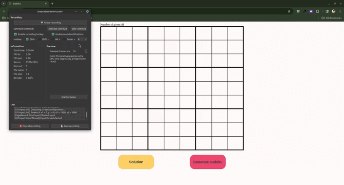

# App Sudoku

Introducing my new Sudoku application 🤓. It allows users to input their own 9x9 sudokus, and the app efficiently solves them. Moreover, it incorporates the ability to generate incomplete sudokus using a sudoku API, adding an extra layer of challenge! 🧠💡

## Demo

[Demo](https://sudoku2.angeles.rocks/)

## 🛠 Skills

- [x] - JavaScript
- [x] - HTML
- [x] - CSS
- [x] - React
- [x] - Python
- [x] - FastAPI
- [x] - Dosuko API

## Authors

[Anggie Alava](https://www.linkedin.com/in/anggiealava/)

## Screenshots

